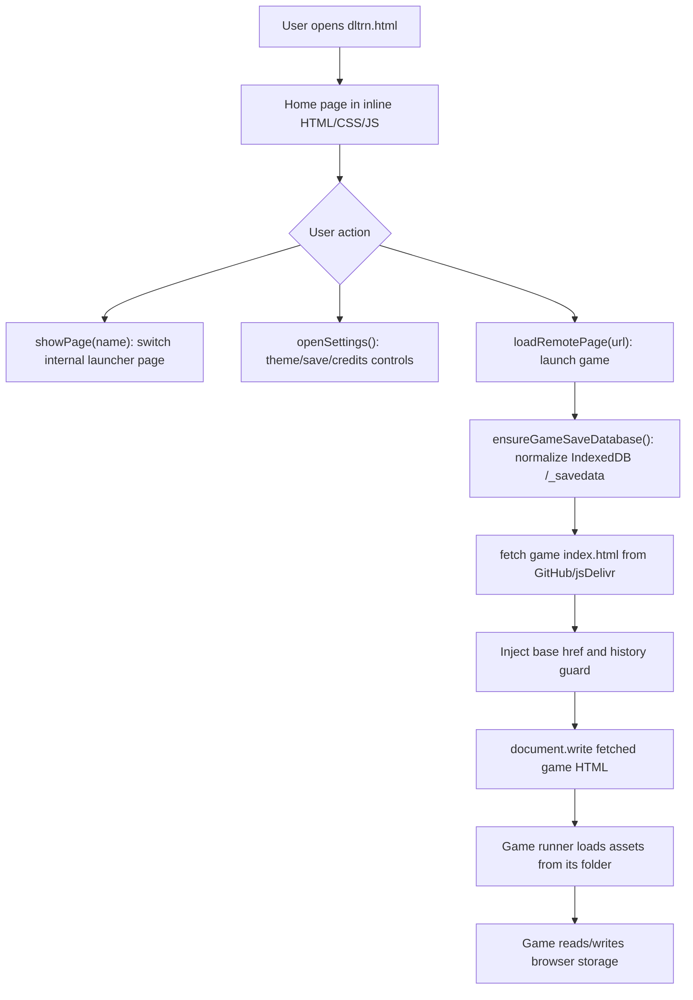
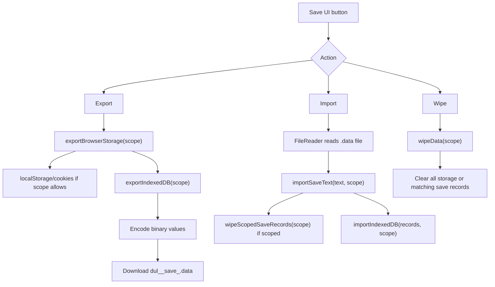
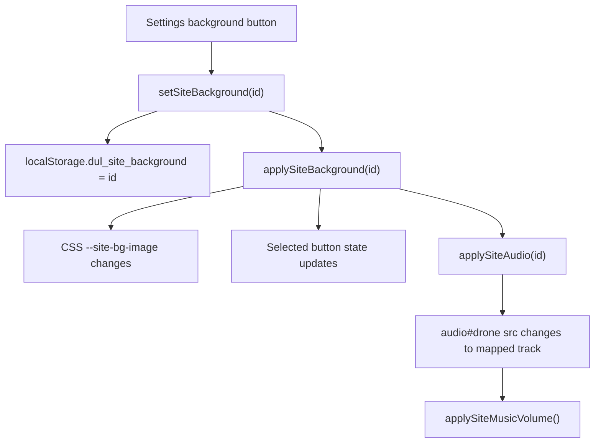

# DUL Project Context

Last inspected by Codex: August 1, 2026.

Project root:

`C:\Users\cmrns_4sj17yr\Documents\Codex\2026-06-28\c-users-cmrns-4sj17yr-desktop-deltarune\work\DUL`

Common local single-file copy used by the user:

`C:\Users\cmrns_4sj17yr\Desktop\Deltarune SNxTr\dltrn.html`

Remote repository:

`https://github.com/storynetwork-camzzz/DUL.git`

This document is a handoff for future Codex instances. It is based on the current files in the repository, especially `dltrn.html`, the `files/` runtime asset tree, root metadata, and recent Git history. If anything here conflicts with the current code later, trust the current code after inspecting it.

## 1. Project Overview

DUL is a static, browser-based launcher for web ports of DELTARUNE, UNDERTALE, DELTARUNE mods, and DELTARUNE/UNDERTALE fan games. The main user-facing file is `dltrn.html`, which is intended to work as a single HTML entry point: the user can double-click it locally, put it in an HTML runner, or host it on a website, and it fetches the game files from the DUL GitHub repository.

The project solves a practical problem for the user: it centralizes many separate web ports and modded game builds into one stylized launcher with save import/export tools, themed backgrounds, site music, credits, and pages for main games, mods, and extras.

The intended audience is the user and people who want to play these web ports from one simple Deltarune/Undertale-styled site. The UI is intentionally pixel-styled, black/white/yellow, and close to the old launcher aesthetic rather than a modern web-app design.

Current development status:

- Active and evolving.
- Implemented as a static website with no package manager, no build system, and no automated tests.
- The active launcher is `dltrn.html`.
- `index.html` and `old-layout.html` exist, but `dltrn.html` is the file most recent work targets.
- The project has many large binary game assets in `files/`.
- Current Git working tree had these pre-existing modified files at inspection time:
  - `files/chapter5/game.unx.part2`
  - `files/chapter5/index.html`
  - `files/chapter5/mus/asgore_serious_drum_only_low.ogg`
  - `files/chapter5/runner.html`
- Do not revert those files unless the user explicitly asks; they may contain local chapter 5 work.

Main project goals:

- Keep `dltrn.html` as a portable single-file launcher.
- Load all games from the one DUL GitHub repository instead of external iframes.
- Preserve working save import/export/wipe behavior for DELTARUNE and UNDERTALE.
- Keep mods and extras organized into separate pages.
- Keep the site responsive on desktop and small Chromebook-sized screens.
- Maintain the Deltarune pixel UI style, hover effects, click sounds, and theme music.
- Allow future Codex instances to add new themes, games, and mods without breaking current working ports.

## 2. Current Features

### Single-File Launcher

What it does:

`dltrn.html` is the active launcher. It contains the home page, subpages, settings modal, credits page, save tools, game-loading functions, and most CSS/JavaScript inline.

Where it is located:

`C:\Users\cmrns_4sj17yr\Documents\Codex\2026-06-28\c-users-cmrns-4sj17yr-desktop-deltarune\work\DUL\dltrn.html`

How it works:

- The document has `<base href="https://cdn.jsdelivr.net/gh/storynetwork-camzzz/DUL@main/files/">`.
- Assets referenced without absolute URLs resolve through that base.
- The launcher fetches remote game `index.html` files with `fetch()`.
- `loadRemotePage(url)` injects a `<base href="...">` into the fetched game HTML, installs a small history guard, then replaces the current document using `document.open()`, `document.write()`, and `document.close()`.
- This means games are not iframed. They replace the launcher page.

Important dependencies:

- Browser `fetch`.
- Browser DOM APIs.
- Browser `IndexedDB`.
- Browser `localStorage`.
- Online access to `cdn.jsdelivr.net` and/or `raw.githubusercontent.com`.

Known bugs or unfinished parts:

- Because games are fetched from GitHub/CDN, the single local file still needs network access.
- If a code runner blocks fetches or changes origin rules, games may not load.
- The launcher is large and manually edited; unrelated refactors are risky.

### Home Page

What it does:

The home page shows large Deltarune and Undertale logo buttons, bottom-left Truffled and Story Network links, and bottom-right `mods` and `extras` buttons.

Where it is located:

- Markup: `dltrn.html`, section `#home-page`.
- CSS: inline in `dltrn.html`, especially `.home-layout`, `.home-choices`, `.home-logo-link`, `.home-footer`, `.home-nav-actions`, `.mods-home`, `.extras-home`.
- Navigation function: `showPage(name)` in `dltrn.html`.

How it works:

- Clicking Deltarune calls `showPage('deltarune')`.
- Clicking Undertale calls `showPage('undertale')`.
- Clicking Mods calls `showPage('mods')`.
- Clicking Extras calls `showPage('extras')`.
- Home navigation buttons use the special `rew.mp3` click sound because they have the `home-select-sound` class.

Important dependencies:

- `files/home-deltarune-tight.png`
- `files/home-undertale-tight.png`
- `files/settings-icon.png`
- `files/story-network-logo.png`
- `files/truffled-logo.png`
- `files/audios/rew.mp3`

Known bugs or unfinished parts:

- Some logo image URLs are pinned to commit hashes. If those image files are updated, the pinned URLs may need to be changed.

### Page Navigation

What it does:

The launcher uses internal page sections instead of separate route files for the main UI.

Where it is located:

- Page sections: `#home-page`, `#deltarune-page`, `#undertale-page`, `#mods-page`, `#network-page`, `#extras-page`, `#credits-page`, `#classic-page`.
- Function: `showPage(name)` in `dltrn.html`.

How it works:

- `showPage(name)` removes `.active` from all `.page` elements, activates `#${name}-page`, updates `localStorage.dul_last_page`, resets scroll positions, updates body mode classes, and updates the URL hash.
- Recognized hash pages at startup are `deltarune`, `undertale`, `mods`, `network`, `extras`, `credits`, and `classic`.

Known bugs or unfinished parts:

- `showPage` assumes a matching element exists. If a new page is added, its section ID must match the page name.

### Deltarune Chapter Selector

What it does:

Provides chapter selection for DELTARUNE chapters 1-5. Chapters 6 and 7 are visible but disabled.

Where it is located:

- Markup: `#deltarune-page` in `dltrn.html`.
- Loader: `loadChapter(chapter)` in `dltrn.html`.
- Assets:
  - `files/chapter1/`
  - `files/chapter2/`
  - `files/chapter3/`
  - `files/chapter4/`
  - `files/chapter5/`
  - `files/icons/0.png` through `files/icons/5.png`

How it works:

- Chapters 1-4 load from `FILES_BASE + "chapter" + chapter + "/index.html"`.
- Chapter 5 loads from the pinned `CHAPTER5_BASE + "index.html"`.
- `FILES_BASE` currently points to `https://cdn.jsdelivr.net/gh/storynetwork-camzzz/DUL@main/files/`.
- `CHAPTER5_BASE` currently points to `https://cdn.jsdelivr.net/gh/storynetwork-camzzz/DUL@aa7528a/files/chapter5/`.

Important dependencies:

- GameMaker/Yoyo HTML5 runner files in each chapter folder.
- Browser storage database `/_savedata`.
- `ensureGameSaveDatabase()` must run before loading to avoid IndexedDB version errors.

Known bugs or unfinished parts:

- Chapter 5 has been fragile historically around videos and music. It currently has local modified files in `files/chapter5/`; inspect before editing.
- Chapter 5 video support is handled inside its runner files, not just in the launcher.

### Undertale Page

What it does:

Provides a simple Undertale page with a centered logo, Start Game, Audio, Export Save, Import Save, and Wipe Save.

Where it is located:

- Markup: `#undertale-page` in `dltrn.html`.
- Loader: `loadUndertale()` in `dltrn.html`.
- Assets: `files/undertale/`.

How it works:

- `loadUndertale()` calls `loadRemotePage(FILES_BASE + "undertale/index.html")`.
- Save buttons call `saveData('undertale')`, `chooseImport('undertale')`, and `wipeData('undertale')`.
- UNDERTALE save scoping is based on filenames in `recordMatchesScope()`.

Known bugs or unfinished parts:

- Save scoping depends on filename patterns: `undertale.ini`, `file\d+`, and `system_information_\d+`.
- If a new Undertale port stores save data under different keys, the save tools may need to be updated.

### Mods Page

What it does:

Provides a `mods` page for modded DELTARUNE builds.

Where it is located:

- Markup: `#mods-page` in `dltrn.html`.
- Loader functions: `loadKaizoRoaringKnight()`, `loadCyanKnight()`, `loadDojoCustomizer()`, `loadUltimateBossRush()`, `loadDeltaruneNetwork()`, and `loadDeltaruneNetworkChapter(chapter)`.
- Assets:
  - `files/kaizo-roaring-knight/`
  - `files/cyan-knight/`
  - `files/dojo-customizer/`
  - `files/ultimate-boss-rush/`
  - `files/deltarune-network/`

Current mod cards:

- Kaizo Roaring Knight
- Cyan Knight
- Dojo Customizer
- Ultimate Boss Rush
- Deltarune Network

How it works:

- Kaizo, Cyan, Dojo, and Boss Rush open confirmation modals because they wipe and replace browser save data before loading.
- Deltarune Network opens its own chapter selector page and does not currently use a wipe-save modal.

Important dependencies:

- Mod-specific `icon.png` files.
- Mod chapter folders such as `chapter3/`, `chapter4/`, or `chapter1` through `chapter5`.
- Save installer constants:
  - `KAIZO_SAVE_URL`
  - `CYAN_SAVE_URL`
  - `DOJO_SAVE_URL`
  - `DOJO_MANAGER_SAVE_FILES`
  - `KAIZO_SAVE_KEY`
  - `CYAN_SAVE_KEY`
  - `DOJO_SAVE_KEY`

Known bugs or unfinished parts:

- `files/no-bullet-cooldowns/icon.png` still exists, but the No Bullet Cooldowns mod is intentionally not wired into the UI because previous versions did not work.

### Mod Save Preinstallation

What it does:

Some mod cards wipe existing browser save data, install a prepared save record into IndexedDB, then launch the modded game.

Where it is located:

- `wipeBrowserSaveForMod()`
- `installModSave(saveUrl, saveKey, label)`
- `installModDirectory(saveKey)`
- `loadKaizoRoaringKnight()`
- `loadCyanKnight()`
- `loadDojoCustomizer()`
- `loadUltimateBossRush()`

All are in `dltrn.html`.

How it works:

- `wipeBrowserSaveForMod()` clears `localStorage`, cookies, `/_savedata`, and `emscripten_filesystem`.
- `installModSave()` fetches a save file as an ArrayBuffer, wraps it as a `Uint8Array`, and writes it to `/_savedata` in store `FILE_DATA`.
- Records are shaped like `{ timestamp: Date, mode: 33206, contents: Uint8Array }`.
- Directory records use mode `16895`.

Known bugs or unfinished parts:

- These mod loaders intentionally wipe browser save data. Do not remove the confirmation dialogs without user approval.
- If a mod needs additional files besides the main save, update both the constants and the loader.

### Network Chapter Selector

What it does:

Deltarune Network has its own page where the user can choose chapters 1-5.

Where it is located:

- Markup: `#network-page` in `dltrn.html`.
- Loader: `loadDeltaruneNetworkChapter(chapter)`.
- Assets: `files/deltarune-network/chapter1/` through `chapter5/`.

How it works:

- The Deltarune Network card calls `showPage('network')`.
- Chapter rows call `loadRemotePage(FILES_BASE + "deltarune-network/chapter" + chapter + "/index.html")`.

Known bugs or unfinished parts:

- No specific known bug was confirmed in the current code. Test each chapter manually after changes to the shared loader.

### Extras Page

What it does:

Provides cards for standalone web ports and fan games.

Where it is located:

- Markup: `#extras-page` in `dltrn.html`.
- Loader functions in `dltrn.html`.
- Assets under many `files/<slug>/` folders.

Current extras:

- Bad Time Simulator
- Deltarune GeoGuessr
- Deltarune Guess Who
- The Upper Hand
- Scampton The Great
- Deltarune Dreamwake
- Deltarune Soulblazers
- Deltarune Plugged Dream
- Deltarune Friendless
- Deltarune Frostveil
- VS Tung Tung Tung Sahur
- LAMBDARUNE
- Full Roaring Knight Remake
- Knight Rematch
- Lost Deltarune
- Free Her!
- Cat and Mouse
- Home Sweet Home
- Asgore Runs Over Dess
- Undertale 10th Anniversary

Removed extras:

- Lightners Live Plus was removed from the UI because it opened an external link instead of staying inside DUL.
- Kromer Kollector was removed from the UI.

How it works:

- Most cards call `loadRemotePage()` with a folder-specific base URL.
- Some bases are pinned to commits, some use `@main`, and some use `raw.githubusercontent.com`.
- Cards use the `game-card` CSS pattern: image area above label area, square-ish card, black background, white border, yellow hover.

Important dependencies:

- GameMaker/Yoyo runner files for many ports.
- LOVE/love.js runtime files for Kristal-based extras such as VS Tung Tung Tung Sahur.
- TurboWarp or single-HTML packaged ports for some extras.
- Godot export files for Deltarune Guess Who.
- `loadRemotePage()` base injection so relative assets resolve correctly.

Known bugs or unfinished parts:

- Deltarune GeoGuessr is known fragile. It has failed on Chromebook and in testing around `4/21` load progress with black/white screens or JavaScript console issues. Do not claim it is fully fixed unless manually verified.
- Some removed extra folders or stale metadata may remain in the repo.

### Credits Page

What it does:

Provides a simple credits page listing DUL, main games, mods, and extras with links to original pages.

Where it is located:

- Markup: `#credits-page` in `dltrn.html`.
- Opened by the settings modal via `openCreditsPage()`.

How it works:

- Settings has a Credits button.
- Clicking Credits closes settings and calls `showPage('credits')`.
- Links open in new tabs.

Known bugs or unfinished parts:

- Credit links are hand-maintained. If a new mod or extra is added, update this page too.

### Settings Modal

What it does:

Provides site-wide controls:

- Toggle Audio
- Use Old Layout
- Use New Layout
- Export Whole Site Save
- Import Whole Site Save
- Site Music Volume slider
- Background/theme picker
- Credits page button

Where it is located:

- Markup: `#settings-modal` in `dltrn.html`.
- CSS: `.settings-*`, `.background-option`, `.site-volume-*`.
- Functions: `openSettings()`, `closeSettings()`, `toggleAudio()`, `setSiteMusicVolume()`, `setSiteBackground()`, `useClassicLayout()`, `useNewLayout()`.

How it works:

- The settings icon only appears on the home page through `body.home-mode .settings-toggle`.
- Background choice is stored in `localStorage.dul_site_background`.
- Site music volume is stored in `localStorage.dul_site_music_volume`.
- `applySiteBackground()` updates CSS variable `--site-bg-image`.
- `applySiteAudio()` swaps the looped `audio#drone` source to the chosen theme track.

Important dependencies:

- `files/backgrounds/*.png`
- `files/audios/theme-*.mp3`
- `files/audios/AUDIO_DRONE.ogg`
- `files/settings-icon.png`

Known bugs or unfinished parts:

- Theme asset URLs are pinned through `THEME_ASSET_VERSION`. New theme files require careful commit/version handling.

### Site Background Themes and Site Music

What it does:

Allows the user to pick a visual background and associated site music.

Where it is located:

- Theme buttons: `#settings-modal` background section.
- Theme maps: `SITE_BACKGROUNDS` and `SITE_AUDIO_TRACKS` in `dltrn.html`.
- Assets:
  - `files/backgrounds/`
  - `files/audios/`

Current background images:

- `90s.png`
- `backrooms.png`
- `birdbrain.png`
- `ch1.png`
- `ch2.png`
- `ch3.png`
- `ch4.png`
- `ch5.png`
- `dialtone.png`
- `dk.png`
- `excuseme.png`
- `excuseme2.png`
- `hotline.png`
- `imposter.png`
- `jackpot.png`
- `kendrick.png`
- `last-sahur.png`
- `mad-spam.png`
- `pirate.png`
- `tadc.png`
- `tung.png`

Current audio tracks:

- `AUDIO_DRONE.ogg`
- `rew.mp3`
- `snd_menumove.mp3`
- `snd_select.mp3`
- `theme-90s.mp3`
- `theme-backrooms.mp3`
- `theme-birdbrain.mp3`
- `theme-ch1.mp3`
- `theme-ch2-cybers-world.mp3`
- `theme-ch3.mp3`
- `theme-ch4.mp3`
- `theme-ch5-thousand-cafe-zukan.mp3`
- `theme-dialtone-normal.mp3`
- `theme-dialtone-somethings-wrong.mp3`
- `theme-dk.mp3`
- `theme-excuseme.mp3`
- `theme-excuseme2.mp3`
- `theme-hotline.mp3`
- `theme-imposter.mp3`
- `theme-jackpot.mp3`
- `theme-kendrick.mp3`
- `theme-last-sahur.mp3`
- `theme-mad-spam.mp3`
- `theme-pirate.mp3`
- `theme-tadc.mp3`
- `theme-tung.mp3`

Known bugs or unfinished parts:

- None confirmed for the latest Excuseme2 theme, but all new theme additions should be manually tested because the maps and modal buttons can get out of sync.

### Audio Buttons and Hover Sounds

What it does:

The site has hover movement sounds, click/select sounds, home navigation sounds, and audio toggle buttons whose icons change between speaker-on and speaker-off.

Where it is located:

- Audio constants and functions in `dltrn.html`.
- CSS and SVG buttons in the save menus and settings modal.

How it works:

- `startAudio()` begins the site music after the first click or keydown because browsers block autoplay.
- Hover events play `snd_menumove.mp3`.
- Most click events play `snd_select.mp3`.
- Home main navigation buttons play `rew.mp3`.
- `toggleAudio()` changes `audio.muted` and calls `updateAudioButtons()`.

Known bugs or unfinished parts:

- Game audio is separate from launcher audio. Once a game replaces the document, the launcher audio controls are gone.

### Save Export, Import, Wipe, and Featured Save

What it does:

The launcher can export, import, and wipe:

- Deltarune saves only
- Undertale saves only
- Whole-site data

It also has a Camzzz All-Boss Save box for DELTARUNE.

Where it is located:

- Markup:
  - Deltarune save menu in `#deltarune-page`
  - Undertale save menu in `#undertale-page`
  - Settings whole-site save buttons
  - Featured save box and info modal
- Functions:
  - `recordMatchesScope(scope, key)`
  - `localStorageMatchesScope(scope, key)`
  - `exportIndexedDB(scope)`
  - `importIndexedDB(databases, scope)`
  - `exportBrowserStorage(scope)`
  - `saveData(scope)`
  - `chooseImport(scope)`
  - `importSaveText(text, scope)`
  - `wipeData(scope)`
  - `wipeScopedSaveRecords(scope)`
  - `downloadFeaturedSave()`
  - `importFeaturedSave()`

How it works:

- Browser save data is exported to JSON files named `dul_${scope}_save_${Date.now()}.data`.
- Current save file format is `format: "deltarune-snxtr-save"` with `version: 3`.
- IndexedDB records are encoded so ArrayBuffers, typed arrays, Blobs, Dates, arrays, and objects can survive JSON export/import.
- Whole-site export includes localStorage, cookies, and IndexedDB.
- Scoped Deltarune/Undertale exports only include matching records from `/_savedata`.
- Deltarune record matching recognizes `filech`, `dojo_manager`, `dr.ini`, `decomp_vars.ini`, `trophies.ini`, `true_config.ini`, `config_*.ini`, and `keyconfig_*.ini`.
- Undertale record matching recognizes `undertale.ini`, `file\d+`, and `system_information_\d+`.
- The featured save is downloaded from pinned commit `3b5c507`, with fallbacks to raw GitHub and local relative paths.

Important dependencies:

- Browser `IndexedDB`.
- Database name `/_savedata`.
- Store name `FILE_DATA`.
- `GAME_SAVE_DB_VERSION = 21`.
- Featured save file `camzzz_deltarune_allbossessave.data`.

Known bugs or unfinished parts:

- Scoped save matching is pattern-based. New games or runners may store saves under different names, and those would not be exported/imported by Deltarune/Undertale scoped actions unless `recordMatchesScope()` is updated.
- Whole-site export is safer when unsure.

### Old Layout

What it does:

Settings can switch to an old-style layout.

Where it is located:

- `old-layout.html`
- Inline `#classic-page` in `dltrn.html`
- `OLD_LAYOUT_URL` in `dltrn.html`
- `useClassicLayout()` and `useNewLayout()` in `dltrn.html`

How it works:

- `useClassicLayout()` loads `OLD_LAYOUT_URL` with `loadStandalonePage()`, replacing the current document.
- `useNewLayout()` stores `localStorage.dul_layout = "new"` and returns to the home page.

Known bugs or unfinished parts:

- `old-layout.html` is a separate file. If core features change in `dltrn.html`, the old layout may not automatically inherit those changes.
- The inline `#classic-page` and standalone `old-layout.html` can drift apart.

### Responsive Layout and Pixel Styling

What it does:

The UI attempts to fit desktop and smaller Chromebook-size screens while keeping a pixel-game look.

Where it is located:

- Inline CSS in `dltrn.html`.
- Media queries around small viewport widths and heights.

How it works:

- CSS variables and `clamp()` are used heavily for logo/card/button sizes.
- `image-rendering: pixelated` and `image-rendering: crisp-edges` are used throughout.
- Subpages use scrollable page sections with custom scrollbars.
- Cards and logos use black backgrounds and white outlines so they stay visible over background themes.

Known bugs or unfinished parts:

- Small-screen overlap has been worked on recently. Always test mods/extras headers and home `mods`/`extras` positions after changing layout CSS.

## 3. Project Structure

The project is a static repository. There is no application server and no source/build separation. Runtime files are committed directly.

### Root Files

#### `dltrn.html`

Purpose:

The active launcher and main entry point.

What to change:

- Main UI layout.
- Settings modal.
- Theme mappings.
- Save/import/export logic.
- Game/mod/extras card lists.
- Loader functions.
- Credits page.

What not to change casually:

- `loadRemotePage()` document replacement behavior.
- `ensureGameSaveDatabase()` and `GAME_SAVE_DB_VERSION = 21`.
- Existing pinned CDN URLs unless you understand why they are pinned.
- Save record shapes and mode values.

How it connects:

It pulls assets from `files/`, launches every web port, and is the file the user usually opens locally.

#### `index.html`

Purpose:

An older or alternate launcher file. It is smaller than `dltrn.html` and appears less current.

What to change:

- Only update if a deployment or user request specifically targets `index.html`.

What not to change casually:

- Do not assume it is the active launcher.

How it connects:

May be served by static hosts that default to `index.html`, but recent user work and testing target `dltrn.html`.

#### `old-layout.html`

Purpose:

Standalone old-layout launcher loaded by the `Use Old Layout` setting.

What to change:

- Old layout UI behavior.
- Old-layout compatibility fixes.

What not to change casually:

- Do not remove it; settings currently references it through `OLD_LAYOUT_URL`.

How it connects:

`dltrn.html` fetches and document-writes this file when the user selects old layout.

#### `camzzz_deltarune_allbossessave.data`

Purpose:

Root copy of the featured Deltarune all-boss save.

What to change:

- Replace only when updating the featured save intentionally.

What not to change casually:

- Do not edit by hand unless you know the save export format.

How it connects:

`fetchFeaturedSaveText()` has fallbacks that include this root file.

#### `.gitattributes`

Purpose:

Defines Git attributes for binary-ish files.

Current contents:

- `files/kaizo-roaring-knight/saves/* -text`
- `files/lightners-live-plus/index.pck filter=lfs diff=lfs merge=lfs -text`

What to change:

- Add binary/LFS rules if needed.

What not to change casually:

- Do not remove binary file handling rules without checking line-ending impact.

Known concern:

- `files/lightners-live-plus` appears stale because Lightners Live was removed from the UI.

#### `.nojekyll`

Purpose:

Disables Jekyll processing on GitHub Pages/static hosting.

What to change:

- Normally never change.

#### `files/ReadMe.md`

Purpose:

Short note about chapter 1-4 ports being buggy and Discord contact.

What to change:

- Documentation updates only.

### Runtime Asset Folders

#### `files/`

Purpose:

All game assets, runner files, icons, themes, audio, and styles used by the launcher.

What to change:

- Add new games/mods/themes here.
- Update game assets here when changing a port.

What not to change casually:

- Do not rename runtime files inside game exports unless the HTML/runner references are updated.
- Do not delete large files because they look unused without checking loader URLs and pinned commit references.

Important current folder sizes:

| Folder | Files | Approx MB | Purpose |
|---|---:|---:|---|
| `files/chapter1` | 296 | 225.19 | DELTARUNE chapter 1 web port |
| `files/chapter2` | 317 | 282.99 | DELTARUNE chapter 2 web port |
| `files/chapter3` | 325 | 359.29 | DELTARUNE chapter 3 web port |
| `files/chapter4` | 323 | 351.21 | DELTARUNE chapter 4 web port |
| `files/chapter5` | 388 | 483.04 | DELTARUNE chapter 5 web port |
| `files/undertale` | 230 | 193.16 | Undertale web port |
| `files/deltarune-network` | 568 | 955.91 | Multi-chapter Deltarune Network mod |
| `files/kaizo-roaring-knight` | 327 | 366.33 | Kaizo Roaring Knight mod |
| `files/cyan-knight` | 330 | 394.80 | Cyan Knight mod |
| `files/dojo-customizer` | 58 | 190.49 | Dojo Customizer mod |
| `files/ultimate-boss-rush` | 65 | 343.57 | Ultimate Boss Rush mod |
| `files/deltarune-dreamwake` | 15 | 151.55 | Dreamwake fangame port |
| `files/deltarune-soulblazers` | 16 | 176.85 | Soulblazers fangame port |
| `files/deltarune-plugged-dream` | 9 | 39.77 | Plugged Dream Kristal/love.js port |
| `files/deltarune-friendless` | 8 | ~51.5 | Friendless Kristal/love.js port |
| `files/deltarune-frostveil` | 10 | ~130 | Frostveil Kristal/love.js port; package is split into three GitHub-safe parts |
| `files/vs-tung-tung-tung-sahur` | 10 | 31.38 | Kristal/love.js port of VS Tung Tung Tung Sahur |
| `files/lambdarune` | 118 | 145.82 | LAMBDARUNE port |
| `files/scampton-the-great` | 17 | 193.21 | Scampton The Great port |
| `files/deltarune-upper-hand` | 118 | 78.77 | The Upper Hand port |
| `files/deltarune-geoguessr` | 17 | 119.13 | Deltarune GeoGuessr port |
| `files/deltarune-guess-who` | 10 | 38.69 | Guess Who Godot export |
| `files/badtimesim` | 108 | 2.56 | Bad Time Simulator |
| `files/asgore-runs-over-dess` | 7 | 29.77 | Asgore Runs Over Dess port |
| `files/cat-and-mouse` | 3 | 55.32 | Cat and Mouse packaged port |
| `files/home-sweet-home` | 2 | 75.31 | Home Sweet Home packaged port |
| `files/free-her` | 5 | 24.31 | Free Her packaged port |
| `files/full-roaring-knight-remake` | 4 | 63.66 | Full Roaring Knight Remake packaged port |
| `files/knight-rematch` | 8 | 205.69 | Knight Rematch TurboWarp packaged port split into GitHub-safe chunks |
| `files/lost-deltarune` | 70 | 143.75 | Lost Deltarune GameMaker/Yoyo port with external localization and audio assets |
| `files/undertale-10th-anniversary` | 11 | 11.62 | Undertale 10th Anniversary port |
| `files/audios` | 25 | 51.81 | Site sounds and theme music |
| `files/backgrounds` | 20 | 2.44 | Site theme backgrounds |
| `files/icons` | 6 | negligible | Deltarune chapter icons |
| `files/no-bullet-cooldowns` | 1 | 0.13 | Removed mod icon only |

#### `files/vs-tung-tung-tung-sahur`

Purpose:

Hosts the VS Tung Tung Tung Sahur extra, converted from a Kristal mod into a browser-runnable LOVE package.

Important files:

- `index.html`: small fullscreen love.js entry page.
- `vs-tung-tung-tung-sahur.love`: zipped Kristal build plus the `vs_tung_tung_tung_sahur` mod.
- `player.js`, `style.css`, `11.5/love.js`, `11.5/love.wasm`, `lua/normalize*.lua`: love.js runtime files.
- `icon.png`: card icon used by `dltrn.html`.

How it connects:

- The Extras card in `dltrn.html` calls `loadVsTungTungTungSahur()`.
- That loader fetches the Tung entry page from `raw.githubusercontent.com`, injects the jsDelivr folder as the asset base, and writes the result into the current document.
- This is intended to work when `dltrn.html` is opened locally because the game page/runtime/package are fetched from HTTPS URLs on the DUL GitHub/jsDelivr setup.

What not to change casually:

- Do not replace this with a direct local `file://` load of the game's `index.html`; browsers block the package/runtime fetches in that mode.
- Do not remove the LOVE runtime files unless the game is rebuilt and retested.

#### `files/style.css`

Purpose:

Shared legacy stylesheet. It defines the `Deltarune` font face from `font.otf` and older launcher styles.

What to change:

- Font loading or shared old-layout styling.

What not to change casually:

- Do not break `font.otf` loading; the main launcher depends on `font-family: Deltarune`.

#### `files/audios/`

Purpose:

Site-level sounds and theme music.

Important files:

- `AUDIO_DRONE.ogg`: default black-theme background audio.
- `snd_menumove.mp3`: hover sound.
- `snd_select.mp3`: normal click/select sound.
- `rew.mp3`: special home button click sound.
- `theme-*.mp3`: theme music.

What to change:

- Add new theme music.
- Replace sound effects if the user requests.

What not to change casually:

- Do not rename audio files without updating constants in `dltrn.html`.

#### `files/backgrounds/`

Purpose:

Theme background images used by the settings menu.

What to change:

- Add or replace background images.

What not to change casually:

- Do not remove images still referenced in `SITE_BACKGROUNDS`.

#### `files/icons/`

Purpose:

Deltarune chapter icon images.

What to change:

- Chapter icon changes only.

#### `depots/`

Purpose:

This folder exists in the repo, but current inspection did not identify it as part of launcher runtime.

What to change:

- Only after inspecting references.

#### `tools/`

Purpose:

This folder exists, but current inspection did not find active tool files.

What to change:

- Only after inspecting current contents.

## 4. Technology Stack

Programming languages:

- HTML
- CSS
- Vanilla JavaScript

Frameworks:

- No frontend framework is used.
- No backend framework is used.

Libraries and packages:

- No package manager configuration was found.
- No `package.json`, Vite, Webpack, Jest, Vitest, Cypress, Playwright, or pytest config was found during inspection.

Runtime/game technologies represented in assets:

- GameMaker/Yoyo HTML5/GXC-style runner exports for DELTARUNE chapters and many extras.
- Godot web export for Deltarune Guess Who.
- Construct 2-style files for Bad Time Simulator.
- TurboWarp/Scratch-style single HTML packaged ports for some extras.

APIs and external services:

- `https://cdn.jsdelivr.net/gh/storynetwork-camzzz/DUL@.../`
- `https://raw.githubusercontent.com/storynetwork-camzzz/DUL/.../`
- Some external image URLs from CodeHS are still used for Undertale and Sans icons.
- Credits links point to GameBanana, GameJolt, itch.io, Turbowarp, official sites, and Story Network/Truffled.

Database or storage systems:

- Browser `IndexedDB`.
- Browser `localStorage`.
- Browser cookies.
- No server database.

Authentication systems:

- None in the project.

Hosting and deployment platforms:

- GitHub repository: `storynetwork-camzzz/DUL`.
- Static hosting is implied by `.nojekyll` and CDN usage.
- jsDelivr is used heavily as the CDN for GitHub files.
- raw GitHub URLs are used for some ports where jsDelivr behavior was not suitable.

Build and development tools:

- Git.
- Browser developer tools.
- PowerShell for local file operations.
- Optional local static server for testing:
  - `python -m http.server 8000`

Important version numbers:

- `GAME_SAVE_DB_VERSION = 21` in `dltrn.html`.
- Current `THEME_ASSET_VERSION = 50ee38ce99b8ab2c9a689815e8bb36d0ee371885`.
- Many game folders are pinned to short or full Git commit hashes in URLs. Treat those as version locks.

## 5. Setup Instructions

### Install Dependencies

There are no project dependencies to install.

From the project root, you can verify no package config exists:

```powershell
rg --files | rg -i "(^package\.json$|vite|webpack|playwright|jest|vitest|cypress|pytest|\.github/workflows|hosting\.json)"
```

If this prints nothing, the current no-build/no-test setup is unchanged.

### Required Environment Files

No `.env` file or environment-variable configuration is required.

No secrets are required to run the project locally. Never add secrets to this repository.

### Configure Services

No external services need local configuration.

The browser must be able to reach:

- `https://cdn.jsdelivr.net`
- `https://raw.githubusercontent.com`
- Any still-referenced external image URLs.

### Run Locally by Double-Clicking

The user's common workflow is to open:

`C:\Users\cmrns_4sj17yr\Desktop\Deltarune SNxTr\dltrn.html`

or the repo copy:

`C:\Users\cmrns_4sj17yr\Documents\Codex\2026-06-28\c-users-cmrns-4sj17yr-desktop-deltarune\work\DUL\dltrn.html`

The launcher itself should appear from the local file. Game launches still fetch remote assets.

### Run Locally with a Static Server

This is useful when testing relative paths, fetched HTML, or browser console behavior.

```powershell
Set-Location "C:\Users\cmrns_4sj17yr\Documents\Codex\2026-06-28\c-users-cmrns-4sj17yr-desktop-deltarune\work\DUL"
python -m http.server 8000
```

Then open:

`http://localhost:8000/dltrn.html`

If `python` is unavailable, use another static file server. Do not add a server dependency unless the user asks.

### Build

There is no build step.

The "build artifact" is the committed static file tree, especially:

- `dltrn.html`
- `old-layout.html`
- `files/`

### Test

There is no automated test command.

Use the manual checklist in section 10.

### Deploy

Deployment is by committing and pushing static files to GitHub.

Typical workflow:

```powershell
Set-Location "C:\Users\cmrns_4sj17yr\Documents\Codex\2026-06-28\c-users-cmrns-4sj17yr-desktop-deltarune\work\DUL"
git status --short
git add -- dltrn.html files/<changed-folder-or-file>
git commit -m "Describe the DUL change"
git push
```

Important deployment note:

If `dltrn.html` references an asset through a pinned commit hash, pushing the asset to `main` is not enough. The HTML must point to a commit that contains the asset. For theme assets, this usually means:

1. Add and commit the new asset files.
2. Update `THEME_ASSET_VERSION` or any other pinned URL in `dltrn.html` to the asset commit.
3. Commit the HTML change.
4. Push both commits.

### Sync the Desktop Copy

If the user tests by double-clicking the Desktop copy, sync the active launcher after editing:

```powershell
Copy-Item -LiteralPath "C:\Users\cmrns_4sj17yr\Documents\Codex\2026-06-28\c-users-cmrns-4sj17yr-desktop-deltarune\work\DUL\dltrn.html" -Destination "C:\Users\cmrns_4sj17yr\Desktop\Deltarune SNxTr\dltrn.html" -Force
```

Do this only when it is relevant to the user's request.

## 6. Architecture and Data Flow

### High-Level Launcher Flow



### Save Data Flow



### Theme Flow



### Major Components

- `dltrn.html` owns all launcher state and UI.
- Game folders are self-contained runtime exports that expect to load relative assets.
- `loadRemotePage()` bridges the launcher to a game by injecting a base URL into the game's HTML.
- Save tools operate on browser storage before a game launches.
- Mods with special saves wipe and install records before loading the modded runner.

### API Requests

There are no application API endpoints. All network requests are static file fetches to GitHub/jsDelivr or external static media.

### Authentication and Permissions

There is no authentication or permission system in the application. Browser storage is local to the current origin.

### Initialization

On load, `dltrn.html`:

- Defines constants for asset bases and save behavior.
- Adds click/keydown handlers to start site audio.
- Adds hover/click handlers for sounds.
- Applies saved theme and volume.
- Reads URL hash to open a matching page if present.
- Defaults to home otherwise.

## 7. Important Implementation Details

### Do Not Convert Game Loading to Iframes

The user explicitly does not want iframe-based game loading. The current system fetches and document-writes the game page. This matters because:

- Games need same-window controls and sizing.
- Browser storage behavior is more predictable.
- Some previous iframe attempts did not work correctly.

### `loadRemotePage()` Is Central

This function is used by almost every game. It:

- Calls `ensureGameSaveDatabase()`.
- Fetches the target page.
- Injects a `<base>` so relative runtime files load from the correct game folder.
- Accepts an optional asset-base override for ports that fetch HTML from one host but should resolve runtime assets from another.
- Injects a history guard to avoid errors when the fetched game manipulates history.
- Replaces the current document.

Breaking this function can break every chapter, mod, and extra.

### IndexedDB Version 21 Is Intentional

`GAME_SAVE_DB_VERSION = 21` is not random. The runner expects or coexists with this version. Previous version mismatches caused errors like "requested version is less than existing version." Do not change this value without testing all save operations and game launches.

### Pinned CDN URLs Are Intentional but Fragile

Examples:

- `CHAPTER5_BASE`
- `GEOGUESSR_BASE`
- `SCAMPTON_BASE`
- `DREAMWAKE_BASE`
- `SOULBLAZERS_BASE`
- `LAMBDARUNE_BASE`
- `THEME_ASSET_VERSION`

Pinned URLs avoid CDN caching surprises, but they also mean a newly pushed asset will not be used until the URL is updated.

### `FILES_BASE` Points to `@main`

Many active loads use:

`https://cdn.jsdelivr.net/gh/storynetwork-camzzz/DUL@main/files/`

This means some changes can go live after push without updating a commit hash. The project mixes pinned and live bases. Inspect before changing.

### Save Scoping Is Filename-Based

Deltarune and Undertale scoped save operations do not understand game semantics. They use filename/key patterns. Changing save filenames or adding new save-bearing games may require changes in `recordMatchesScope()`.

### Some Game Folders Use Split Files

Many GameMaker ports split large files:

- `game.unx.part1`, `game.unx.part2`, etc.
- `runner.data.part1`, `runner.data.part2`, etc.

The corresponding `index.html` or `runner.js` usually reconstructs or fetches these parts. Do not rename part files.

#### `files/deltarune-plugged-dream`

Purpose:

Hosts the Deltarune Plugged Dream extra, converted from its Windows LOVE/Kristal build into a browser-runnable `.love` package.

Important files:

- `index.html`: fullscreen love.js entry page.
- `deltarune-plugged-dream.love`: zipped Kristal build plus the `plugged_dream` mod.
- `player.js`, `style.css`, `11.5/`, `lua/`: love.js runtime files copied from the working VS Tung setup.
- `icon.png`: card icon used by `dltrn.html`.

How it connects:

- The Extras card in `dltrn.html` calls `loadDeltarunePluggedDream()`.
- That loader fetches the Plugged Dream entry page from `raw.githubusercontent.com`, injects the jsDelivr folder as the asset base, and writes the result into the current document.
- Boss battle music is referenced in `mods/plugged_dream/scripts/battle/encounters/romb.lua` as `self.music = "ramb_boss"` and the packaged audio is `mods/plugged_dream/assets/music/ramb_boss.ogg`. As of August 1, 2026, that packaged OGG has been replaced with the user's Haywire track.

Browser compatibility patches inside the `.love` package:

- Disables Discord RPC and HTTPS libraries.
- Uses `src/engine/syncloader.lua` instead of Kristal's thread asset loader.
- Disables the dev hotswapper, which calls Lua `package.searchpath`.
- Removes LuaJIT-only `goto continue` usage.
- Strips the BOM from `SoulSword.lua`.
- Makes the Board Writer RGB shader optional and WebGL-safe.
- Replaces `bit.band` tile gid parsing with arithmetic checks.
- Adds a web font fallback in `Assets.getFont()`.
- Clamps invalid audio pitch values and changes known decimal `electric_talk` pitch calls to `Utils.random(...)`, preventing battle crashes from zero/invalid pitch values in browser Lua.

### Kristal/love.js Ports Need HTTPS Assets

VS Tung Tung Tung Sahur, Deltarune Plugged Dream, Deltarune Friendless, and Deltarune Frostveil are Kristal/love.js ports packaged into `.love` files and launched through love.js.

Important compatibility details:

- The single-file local workflow is still `dltrn.html`; do not open an individual Kristal port `index.html` directly from disk as the supported path.
- The local launcher works by fetching the game page and `.love` package from the DUL repo/CDN over HTTPS.
- Kristal port loader functions fetch `index.html` from `raw.githubusercontent.com` and pass the jsDelivr folder as the asset base to `loadRemotePage()`. This avoids stale jsDelivr HTML while preserving good script/WASM MIME types for the small runtime files.
- The `index.html` intentionally points the large `.love` package at `raw.githubusercontent.com`; jsDelivr returned `403` for this 27 MB package during local-launch testing.
- The package was built from Kristal `0.11.0-dev`, matching the mod's `mod.json`.
- Browser-only patches inside the `.love` package disable Discord RPC and HTTPS libraries, use a synchronous asset loader instead of a LOVE thread, remove LuaJIT-only `goto` syntax, replace global `bit` usage in tiled gid parsing with arithmetic checks, and fall back to the main/default font when Kristal resolves an unloaded or missing font during web play.
- The Tung package's text font aliases `assets/fonts/main.ttf`, `assets/fonts/main_mono.ttf`, and `assets/fonts/small.ttf` are intentionally replaced with the user-provided 8bitoperator font while keeping `.ttf` filenames, because the Kristal loader scans `.ttf` paths and the browser build should render Undertale-style text.
- If the Kristal package is rebuilt, preserve those compatibility patches or retest the port from the local `dltrn.html` wrapper before pushing.
- Friendless was extracted from its fused `DEVICE_FRIEND.exe` LOVE archive. Its browser package retains the Friendless engine and mod, removes the bundled Git history, disables native Discord/HTTPS libraries, uses a synchronous asset loader, replaces LuaJIT-only `goto` blocks, and uses arithmetic Tiled GID flag parsing.
- Frostveil was extracted from its fused `Frostveil.exe` LOVE archive. It uses the already browser-patched Kristal 0.10 runtime from Friendless with the Frostveil `chapter5wr_windows` mod, an optional-FFI Chapter 4 library patch, and an engine-target override for mod ID `chapter_5_weird`. Its roughly 136 MB package is stored as `deltarune-frostveil.love.part1` through `.part3`; `files/deltarune-frostveil/player.js` downloads and joins those parts before starting love.js. Keep all three parts together and update the split-loader count if the package is rebuilt.

### Large TurboWarp HTML Ports May Be Split

Some itch/TurboWarp-packaged ports are single generated HTML files. Knight Rematch is one of these, but the source HTML is about 216 MB, which is too large for a single regular GitHub blob. The active DUL port therefore stores it in `files/knight-rematch/index.part001` through `index.part006` plus a small `files/knight-rematch/index.html` loader.

Important details:

- Do not delete the `index.part*` files. They are the real game HTML split into safe chunks.
- `.gitattributes` marks `files/knight-rematch/index.part*` as `-text -diff`; keep that rule so Git does not line-ending-normalize or render diffs for packed chunks.
- `files/knight-rematch/index.html` fetches those parts as byte arrays, concatenates them in order, decodes once, then writes the reconstructed TurboWarp page into the document. Do not change this to per-part `response.text()`; that can corrupt the packed runtime.
- The original external `https://static.itch.io/htmlgame.js` helper tag was removed by byte-level exact replacement before chunking. Avoid text reserialization of the packed source because it previously caused `Scaffolding is not defined` / `Invalid or unexpected token` runtime failures.
- Pixel rendering CSS is injected after the reconstructed page is written so the game canvas stays crisp without rewriting the huge packed source.
- If the source port is updated later, regenerate all `index.part*` files together from the new full HTML and keep each part comfortably below GitHub's 100 MB file limit.

### Pixel Rendering Matters

The visual style depends on:

- `image-rendering: pixelated`
- `image-rendering: crisp-edges`
- Black panels
- White outlines
- Yellow hover states
- The `Deltarune` font

Do not "modernize" the UI unless the user asks.

### Desktop Copy May Need Manual Sync

The repo copy and Desktop copy are separate. The user often tests by double-clicking:

`C:\Users\cmrns_4sj17yr\Desktop\Deltarune SNxTr\dltrn.html`

If you edit the repo copy only, the user's double-click test may still show an old version.

### Credits Must Be Updated Manually

Adding a mod or extra requires updating:

- The page/card markup.
- The loader function/constants.
- The credits page.
- Sometimes the classic page.

### Removed Items May Leave Assets Behind

Examples:

- No Bullet Cooldowns has only an icon folder remaining.
- `.gitattributes` still mentions Lightners Live Plus.

Do not assume a folder being present means it is active in the UI.

## 8. How to Make Common Changes

### Add a New Theme

Files to inspect:

- `dltrn.html`
- `files/backgrounds/`
- `files/audios/`

Files to modify:

- Add image to `files/backgrounds/<theme-id>.png`.
- Add audio to `files/audios/theme-<theme-id>.mp3`.
- Update `dltrn.html`.

Current implementation:

- Background options are buttons in the settings modal.
- `SITE_BACKGROUNDS` maps a theme ID to an image URL.
- `SITE_AUDIO_TRACKS` maps the same theme ID to a music URL.
- `THEME_ASSET_VERSION` controls the pinned commit used by `BACKGROUND_BASE` and theme audio.

Safest change:

1. Copy assets into `files/backgrounds/` and `files/audios/`.
2. Commit the assets first if using pinned CDN URLs.
3. Add a matching settings button.
4. Add matching entries to `SITE_BACKGROUNDS` and `SITE_AUDIO_TRACKS`.
5. Update `THEME_ASSET_VERSION` to a commit containing the assets.
6. Test the theme on home, mods, extras, Deltarune, and settings.

Possible side effects:

- If the asset commit hash is wrong, previews or music will 404.
- If only one map is updated, the background or audio may not change.

### Add a New Extra Game

Files to inspect:

- `dltrn.html`
- Similar existing game folder under `files/`
- The candidate game's `index.html` and runtime files.

Files to modify:

- `files/<slug>/`
- `dltrn.html`
- Possibly `old-layout.html` if the old layout should include it.

Current implementation:

- Extras are cards in `#extras-page`.
- Each card calls a global loader function.
- Loader functions usually call `loadRemotePage(<base> + "index.html?...")`.

Safest change:

1. Create `files/<slug>/`.
2. Copy the web export into that folder.
3. Make sure the export can load assets relative to its own folder.
4. Add an icon/card image.
5. Add a card to `#extras-page`.
6. Add a loader function in `dltrn.html`.
7. Add a credit link in `#credits-page`.
8. Test by clicking the card from the extras page.

Possible side effects:

- Large files may require splitting or special loader fixes.
- Some engines need special handling for audio worklets, videos, or texture pages.
- Some existing web ports try to navigate to external URLs; those should be fixed or removed.

### Add a New Mod

Files to inspect:

- `dltrn.html`
- Existing mod folders under `files/`
- The modded game's `index.html` and runner files.
- Any save files needed by the mod.

Files to modify:

- `files/<mod-slug>/`
- `dltrn.html`
- Possibly `old-layout.html`

Current implementation:

- Mods are cards in `#mods-page`.
- Some mods show a confirmation modal because they wipe saves.
- Deltarune Network uses a separate chapter selector.

Safest change:

1. Add the mod assets under `files/<mod-slug>/`.
2. Add `icon.png`.
3. If the mod is one chapter, add one loader function.
4. If the mod is multi-chapter, add a subpage like `#network-page` or reuse that pattern.
5. If the mod needs a preloaded save, add save constants and a confirmation modal.
6. Add card styling class/color if needed.
7. Add credits.
8. Test the launch and save behavior.

Possible side effects:

- Mod save installation can wipe user data. Keep confirmation text clear.
- Modded GameMaker builds may require assets from the exact patched Windows version.

### Update the Save System

Files to inspect:

- `dltrn.html`, save functions around `recordMatchesScope()`, `exportIndexedDB()`, `importIndexedDB()`, and `ensureGameSaveDatabase()`.

Files to modify:

- Usually only `dltrn.html`.

Current implementation:

- Save files are JSON with encoded binary records.
- Scoped exports/imports filter only `/_savedata/FILE_DATA`.
- Whole-site export includes more browser storage.

Safest change:

1. Export a backup before editing.
2. Inspect current IndexedDB keys in the browser if adding a new scope.
3. Update `recordMatchesScope()` carefully.
4. Test export, import, wipe, and game load.
5. Confirm imported record counts and verified record counts.

Possible side effects:

- A bad scope can delete wrong saves.
- A bad DB version can prevent games from opening storage.

### Edit a Page or Component

Files to inspect:

- `dltrn.html`.

Files to modify:

- `dltrn.html`.

Current implementation:

- The launcher is plain sections and inline CSS.
- UI components are not reusable JS components; they are repeated HTML patterns.

Safest change:

1. Locate the relevant section by ID.
2. Update only that section and its nearest CSS.
3. Preserve existing classes used by JS such as `.sound-target`, `.home-select-sound`, `.row`, `.game-card`, `.audio-toggle`.
4. Test hover/click sounds and keyboard navigation if rows are involved.

Possible side effects:

- Removing a class can break audio, layout, or keyboard selection.

### Change Design or Styling

Files to inspect:

- Inline CSS at the top of `dltrn.html`.
- `files/style.css` only if changing shared font/legacy styling.

Files to modify:

- Usually `dltrn.html`.

Current implementation:

- CSS variables, absolute/fixed UI placement, responsive media queries, and custom scrollbars.

Safest change:

1. Search for existing classes before adding new ones.
2. Keep the pixel aesthetic.
3. Test at desktop width and Chromebook/small-screen widths.
4. Check for overlap between back buttons and titles.

Possible side effects:

- Small-screen media queries can override desktop rules.
- Background themes can reduce readability unless panels keep black fill and white outlines.

### Add or Modify an API Endpoint

There are no API endpoints in DUL. If the user asks for one, clarify whether they mean:

- A static file fetch.
- A new hosted backend, which would be new architecture.
- A GitHub/raw asset path.

Safest approach:

- Prefer static files in `files/`.
- Do not introduce a backend unless explicitly requested.

### Update Stored Data

Files to inspect:

- `camzzz_deltarune_allbossessave.data`
- Save files under mod folders.
- Save constants in `dltrn.html`.

Files to modify:

- The relevant `.data`, `filech*`, or `.ini` save files.
- `dltrn.html` if URLs or keys change.

Safest change:

1. Preserve binary data exactly.
2. Use `Copy-Item` or normal file copy for binary files.
3. Do not open/save binary files through text editors.
4. Commit and update pinned URLs if needed.
5. Test import and launch.

Possible side effects:

- Wrong save key means the game will not see the save.
- Wrong mode can make the runner treat a file as a directory or vice versa.

### Fix a Bug

Files to inspect:

- Start with the feature's markup/function in `dltrn.html`.
- Inspect the specific game folder if the bug occurs after launch.
- Check browser console logs.

Files to modify:

- The smallest relevant launcher or game export file.

Safest change:

1. Reproduce or understand the user-provided error.
2. Identify whether the bug is in launcher code, game HTML, runner JS, or missing assets.
3. Avoid global changes to `loadRemotePage()` unless many games are affected.
4. Test the broken case and a few unrelated working games.

Possible side effects:

- Runner changes can fix one GameMaker port and break another.

### Add a Dependency

Current implementation:

- No dependencies.

Safest change:

- Avoid adding dependencies unless truly necessary.
- If adding one, document it here, add the config file, and provide exact install/build/test commands.

Possible side effects:

- Adding a build system would change the project workflow and could break the user's single-file expectation.

### Change Environment Variables

Current implementation:

- No environment variables.

Safest change:

- Do not introduce env vars for static frontend-only features.
- Never commit secrets.

### Build and Deploy an Update

Files to inspect:

- `git status --short`
- `git diff -- <files>`
- Any pinned URL references in `dltrn.html`.

Commands:

```powershell
Set-Location "C:\Users\cmrns_4sj17yr\Documents\Codex\2026-06-28\c-users-cmrns-4sj17yr-desktop-deltarune\work\DUL"
git status --short
git add -- dltrn.html files/<changed-path>
git commit -m "Describe the update"
git push
```

Possible side effects:

- If uncommitted user changes exist, do not stage them unless they are part of the request.
- CDN caches may delay `@main` updates.
- Pinned URLs will not update automatically.

## 9. Coding Standards

Formatting:

- Plain HTML/CSS/JS.
- Existing indentation is two spaces in many areas of `dltrn.html`.
- Keep edits local and avoid reformatting the whole file.

Naming:

- Page sections use IDs like `home-page`, `deltarune-page`, `extras-page`.
- Loader functions use names like `loadDeltaruneGuessWho()` and `loadKaizoRoaringKnight()`.
- Theme IDs are lowercase strings or snake-ish IDs such as `mad_spam`, `dialtone_normal`, and `90s`.
- CSS classes are descriptive and often game-specific, such as `.game-card.scampton` or `.source-link.dreamwake`.

File organization:

- Put runtime assets under `files/<slug>/`.
- Put site theme audio under `files/audios/`.
- Put site background images under `files/backgrounds/`.
- Put chapter icons under `files/icons/`.

Component patterns:

- Main UI sections are plain `<section class="page">`.
- Cards are `<button class="game-card ... sound-target" onclick="...">`.
- Menu rows are `<a class="row sound-target" href="javascript:...">`.
- Save/action buttons use `.save-button` or `.pixel-button`.

Error handling:

- Load errors generally show `alert()`.
- Save import/export errors show `alert()` with error messages.
- Audio `play()` calls use `.catch(() => {})` because autoplay can fail.

Logging:

- Launcher code does not use much logging.
- Game runners may log to browser console.

Comments:

- Minimal comments in the launcher.
- Add comments only for non-obvious compatibility workarounds.

Types:

- No TypeScript.
- Dynamic JavaScript only.

Security practices:

- No secrets should be committed.
- Do not add private tokens to static HTML.
- Be careful with `document.write()` because it intentionally writes fetched HTML. Only use trusted DUL-hosted or user-approved game pages.

## 10. Testing and Verification

Existing automated tests:

- None found.

How to run tests:

- No test command exists.

Manual verification checklist:

1. Open `dltrn.html`.
2. Confirm the home page renders with Deltarune, Undertale, Mods, Extras, settings icon, Truffled link, and Story Network link.
3. Hover and click UI elements and confirm sounds play.
4. Open Settings.
5. Change background themes and confirm background image and site music change.
6. Move Site Music Volume slider and confirm volume changes and persists after refresh.
7. Click Credits and confirm the credits page opens and links are visible.
8. Click Back from credits, mods, extras, Deltarune, Undertale, and Network pages.
9. Open Deltarune page and verify chapter 1-5 rows display with icons.
10. Launch one stable Deltarune chapter and check it starts.
11. Launch Undertale and check it starts.
12. Export a Deltarune save and verify a `.data` file downloads.
13. Import a known Deltarune save and confirm the imported/verified record counts are plausible.
14. Wipe Undertale saves and confirm Undertale save records are removed without wiping Deltarune records.
15. Open Mods and verify all active cards are present.
16. For save-wiping mods, confirm the warning modal appears.
17. Launch at least one mod that uses preinstalled saves.
18. Open Extras and verify all active cards are present.
19. Launch several representative extras:
    - A GameMaker/Yoyo port such as Scampton or Dreamwake.
    - A Kristal/love.js port such as VS Tung Tung Tung Sahur.
    - A packaged HTML port such as Free Her or Cat and Mouse.
    - Deltarune Guess Who.
20. Test small viewport sizing, especially home Mods/Extras separation and subpage back/title layout.
21. Check browser console for missing asset 404s or runner exceptions.

Important edge cases:

- Opening from `file:///` by double-clicking.
- Opening from a local HTTP server.
- Opening after clearing all site data.
- Importing an older save format containing `\n\n|\n\n`.
- Scoped imports vs whole-site imports.
- Themes with bright backgrounds.
- Chromebook-sized screens.
- Pinned CDN cache behavior after a push.
- Newly added `@main` CDN folders may need a GitHub push before the user's local `dltrn.html` can fetch them.

## 11. Known Problems and Technical Debt

Confirmed or strongly supported by current files/history:

- No automated tests.
- The active launcher is a large single HTML file, making accidental regressions easy.
- The project mixes `@main`, pinned jsDelivr URLs, and raw GitHub URLs.
- Some old or removed assets/references remain:
  - `files/no-bullet-cooldowns/icon.png` exists but is not active.
  - `.gitattributes` mentions `files/lightners-live-plus/index.pck` even though Lightners Live is removed from the UI.
- `index.html` appears older/stale relative to `dltrn.html`.
- `old-layout.html` is separate and can drift from `dltrn.html`.
- Deltarune GeoGuessr remains a known fragile port and has had Chromebook/loading issues.
- Save scoping is filename-pattern-based and could miss new save keys.
- Large binary assets make cloning, pushing, and CDN cache behavior heavier than a normal static site.
- There are current uncommitted changes in chapter 5 files; future agents must inspect before editing.

Possible concerns, inferred from project shape:

- Some third-party web ports may contain code that assumes a specific origin, URL, or browser feature.
- Some games may require WebGL, SharedArrayBuffer-like behavior, or browser features unavailable on some Chromebooks.
- Pinned external CodeHS image URLs could break if those hosted images disappear.

Security concerns:

- There are no secrets in the inspected configuration.
- The launcher intentionally fetches and writes remote HTML. Keep remote pages within trusted DUL-controlled or user-approved sources.

Performance concerns:

- The repository and runtime assets are very large.
- Games can be hundreds of MB and may be slow to load.
- jsDelivr/raw GitHub large file fetches may be unreliable under network restrictions.

Missing documentation:

- Before this file, there was no complete handoff.
- There is no formal list of which games are known good on Chromebook.

## 12. Recent Work

Based on recent Git history:

- `179e6d6 Add Excuseme2 theme option`
- `50ee38c Add Excuseme2 theme assets`
- `8600054 Remove Kromer Kollector from extras`
- `7f4a275 Keep home mods and extras separated`
- `29298a5 Improve small screen page spacing`

What appears complete:

- Deltarune Plugged Dream was added as an Extras card and classic-layout extra, packaged as a Kristal/love.js port, and smoke-tested from the local `dltrn.html` wrapper through title menu and Start into difficulty select.
- Deltarune Frostveil is packaged as a Kristal/love.js port and represented in both Extras layouts. Its large package is split into three remotely reassembled parts for GitHub compatibility.
- VS Tung Tung Tung Sahur was added as an Extras card and documented as a Kristal/love.js port. The package now includes a browser-only font fallback for Kristal text/UI crashes seen during local web testing.
- The Last Sahur theme assets and launcher option are present.
- Excuseme2 theme assets and option are present.
- Kromer Kollector is no longer in the active extras page.
- Lightners Live is no longer in the active extras page.
- Mods and Extras buttons have recent separation work.
- Extra card image/text layout has been adjusted recently.
- Deltarune Network, Dojo Customizer, Ultimate Boss Rush, Dreamwake, Soulblazers, Plugged Dream, Lambdarune, Full Roaring Knight Remake, Knight Rematch, Free Her, Cat and Mouse, Home Sweet Home, Asgore Runs Over Dess, and Undertale 10th Anniversary are represented in `dltrn.html`.
- Lost Deltarune is represented in `dltrn.html` and packaged under `files/lost-deltarune`. Its `data.win` is stored as six `game.unx.part*` chunks, while its root OGG files and `loc/*.json` files are explicitly included in the runner manifest. GameMaker's browser runner cannot synchronously enumerate or read those cached JSON files, so the same localization data is compiled into `gml_GlobalScript_loc`; `tools/patch-lost-deltarune-localization.csx` and `tools/lost-deltarune-loc.gml` document and reproduce that compatibility patch. Its CDN asset base is pinned to commit `126703c` because jsDelivr served stale large chunks from `@main` even after its index had updated. The Windows-only `execute_shell_simple_ext.dll` calls are replaced by browser-safe no-op shims because web pages cannot launch local shell commands. The game renders to a fixed 640x480 surface but incorrectly reads the physical browser viewport while initializing UI coordinates. `files/lost-deltarune/index.html` temporarily exposes the 640x480 logical dimensions during runner startup, then uses `visualViewport` for CSS-only aspect-fit scaling. Removing that compatibility layer causes menus to render offscreen on large displays.

What appears in progress:

- Chapter 5 local files are modified in the working tree.
- Deltarune GeoGuessr remains a known unresolved or fragile port.

Likely next steps:

- Preserve current working extras/mods while fixing only requested issues.
- Continue adding themes and extras through the established card/loader/credits pattern.
- If working on chapter 5, inspect the local dirty files first.
- If working on GeoGuessr, gather browser console logs and compare runner/export behavior before attempting broad fixes.

## 13. Rules for the Next Codex

- Read this entire file before modifying the project.
- Inspect the actual current code before assuming this document is still accurate.
- Preserve existing working behavior unless the user explicitly requests a change.
- Make focused changes instead of rewriting unrelated sections.
- Reuse the project's existing components, utilities, patterns, and styling.
- Never expose secrets or commit private credentials.
- Before implementing a request, identify the relevant files and understand how the current feature works.
- After making a change, run the available tests and perform relevant manual checks.
- Explain exactly what was changed, which files were modified, and how the user can test it.
- When the user asks how to do something, provide exact project-specific steps, file paths, commands, and code locations.
- Do not give vague general programming advice when the answer can be based on the DUL codebase.
- If information is uncertain, inspect the project instead of guessing.
- Keep this context file updated whenever major features, architecture, setup steps, dependencies, or deployment procedures change.

## 14. Request-Handling Workflow

Use this process whenever the user requests a change:

1. Restate the requested outcome internally.
2. Read `CODEX_PROJECT_CONTEXT.md`.
3. Inspect the relevant current files.
4. Identify dependencies and possible side effects.
5. Create a focused implementation plan.
6. Make the smallest reliable change that completes the request.
7. Test or verify the result.
8. Report:
   - What was changed.
   - Every modified file.
   - Important implementation details.
   - Commands that were run.
   - How the user can test it.
   - Any remaining limitations.

## 15. Quick Reference

Main entry points:

- Active launcher: `C:\Users\cmrns_4sj17yr\Documents\Codex\2026-06-28\c-users-cmrns-4sj17yr-desktop-deltarune\work\DUL\dltrn.html`
- Standalone old layout: `C:\Users\cmrns_4sj17yr\Documents\Codex\2026-06-28\c-users-cmrns-4sj17yr-desktop-deltarune\work\DUL\old-layout.html`
- Older alternate launcher: `C:\Users\cmrns_4sj17yr\Documents\Codex\2026-06-28\c-users-cmrns-4sj17yr-desktop-deltarune\work\DUL\index.html`

Important directories:

- Runtime assets: `C:\Users\cmrns_4sj17yr\Documents\Codex\2026-06-28\c-users-cmrns-4sj17yr-desktop-deltarune\work\DUL\files`
- Site audio: `C:\Users\cmrns_4sj17yr\Documents\Codex\2026-06-28\c-users-cmrns-4sj17yr-desktop-deltarune\work\DUL\files\audios`
- Site backgrounds: `C:\Users\cmrns_4sj17yr\Documents\Codex\2026-06-28\c-users-cmrns-4sj17yr-desktop-deltarune\work\DUL\files\backgrounds`
- Deltarune chapters: `files\chapter1` through `files\chapter5`
- Undertale: `files\undertale`
- Mods: `files\kaizo-roaring-knight`, `files\cyan-knight`, `files\dojo-customizer`, `files\ultimate-boss-rush`, `files\deltarune-network`
- Extras: see `#extras-page` in `dltrn.html`.

Development command:

```powershell
Set-Location "C:\Users\cmrns_4sj17yr\Documents\Codex\2026-06-28\c-users-cmrns-4sj17yr-desktop-deltarune\work\DUL"
python -m http.server 8000
```

Build command:

- None.

Test command:

- None.
- Use the manual checklist in section 10.

Deployment process:

```powershell
git status --short
git add -- <changed-files>
git commit -m "Describe the DUL change"
git push
```

Environment-variable names:

- None currently used.

Important configuration files:

- `.gitattributes`
- `.nojekyll`
- `dltrn.html`
- `old-layout.html`
- `files/style.css`

Major services:

- GitHub repository: `https://github.com/storynetwork-camzzz/DUL`
- jsDelivr CDN for GitHub files.
- raw GitHub static file URLs.
- Browser IndexedDB/localStorage/cookies.

Areas currently under development or fragile:

- Chapter 5 local files.
- Deltarune GeoGuessr.
- Small-screen responsive layout.
- Theme additions and pinned theme asset versioning.
- Save import/export compatibility for new games/mods.
